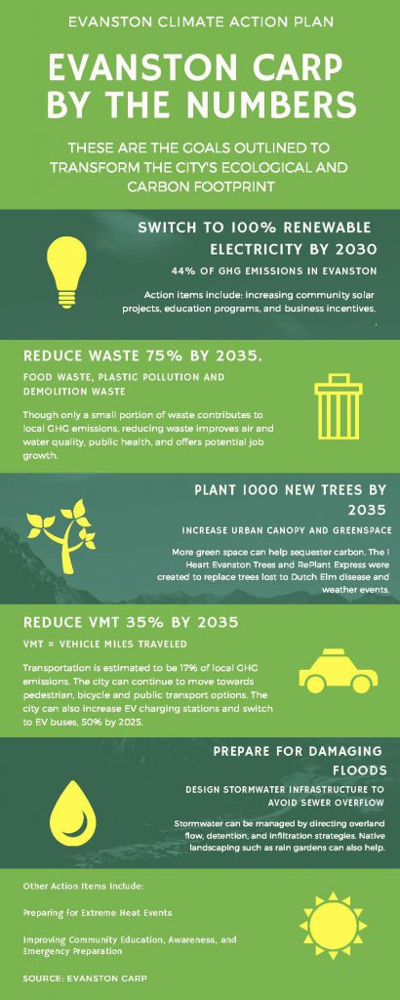

# Evanston_Viz_2019

A project to analyze, visualize, and communicate City of Evanston Open Data (in response to call for submissions to the [Love Data Week 2019 contest](https://sites.northwestern.edu/lovedataweek/contest/)). Ideally, the visuals created here will tell a coherent story to be printed for the competition. **Any potential prize money is to be used for food for NU data science community events.**

## Story direction (subject to revision)

Evanston passed its [Climate Action and Resiliency Plan](https://www.cityofevanston.org/home/showdocument?id=45170) last Fall. There are many components to it, but the major initiatives are summarized in the following

The working 'story' would be to create visualizations related to CARP, raising awareness and providing data-driven insight into its initiatives.

## Getting Started

All skill levels and creative input are welcome! For example, if you have no coding experience, but would like to workup something with Adobe Illustrator, that would be really helpful in finalizing visualizations. In that same vein, if you don't want to set up a Python environment, you may want to look at [Charticulator](https://charticulator.com/), [Data Illustrator](http://data-illustrator.com/), or some other kind of web app that lets you explore and build data visualizations from a browser. Tableau Desktop app is also highly recommended as it has a freemium public version and [free fully-licensed academic version](https://www.tableau.com/academic)

There are many potentially gratuitous aspects to the repo structure (generated from [cookiecutter data science template](cookiecutter data science), but they've been left here for reference on how one more approach this for a longer-term, larger-team project (Sphinx docs, tox testing, etc.).

The goal would be to interact with this repo through git, but if you have a contribution and are unsure of how to commit it to the repo (or if you would like to be added as an collaborator on Github), just contact [@monadnoc](https://github.com/monadnoc).  
To give a clear workflow example, if you like working with jupyter notebooks and python Pandas library:
1. Fork this repo to your GitHub account
2. `git clone` the forked repo to you desktop (or download .zip); optional: `git remote add upstream ...` to keep your fork in sync with the master (see [this](https://help.github.com/articles/configuring-a-remote-for-a-fork/) and [this](https://help.github.com/articles/syncing-a-fork/))
3. place relevant Evanston open data (see below) in `data/raw/`
4. open your notebook in the `notebooks` folder
5. read that data into your notebook with `pandas.read_csv(../data/raw/example.csv)`, where example is a placeholder name.
6. as you process data as a `DataFrame`, you could save it `pandas.DataFrame.to_csv(../data/interim/blah.csv)`, where `blah.csv` is a placeholder.
7. When you have a jupyter notebook you'd like to save, push it to your forked repo with `git add *.ipynb`, `git commit -m '[some message]'` and `git push origin [current branch]` then go to Github and you should be able to create a Pull Request from that commit&mdash;otherwise, you could just click and drag the iPython notebook to the `notebook/` repo folder in a browser.

How to handle data automatically is still up for debate, as most command-line solutions rely on AWS S3 buckets for dumping data into a repo after its cloned. In general, it's considered bad form to host your actual data on Github (when it's above 50 MB, e.g.). So the way to go at the moment is just adding processing and visualization scripts to the repo (as in the above example workflow) and manually downloading data from the [Evanston open data portal](https://data.cityofevanston.org/) for local development.

### Example analysis towards visualization
Switch to 100% renewable electricity: the [solar projects by month dataset](https://data.cityofevanston.org/Community-Development/Solar-Applications-by-Month/j7yr-bd8i) could be mapped to identify hotspots for solar projects or correlations between such projects and wealth, race, etc (with census data).

Reduce VMT 35%: the [city owned electric vehicle charging station](https://data.cityofevanston.org/dataset/City-owned-Electric-Vehicle-Charging-Station-Usage/nx7w-jb8v) could provide some time-series insight into projections for meeting that goal (is electric vehicle charging increasing? are there certain locations or times when it stagnates?)...Or the [Divvy usage statistics](https://data.cityofevanston.org/Community-Development/Evanston-Divvy-Monthly-Metrics/88ex-7bq5)

Plant 1000 new trees by 2035: the [tree map](https://data.cityofevanston.org/Information-Technology-includes-maps-geospatial-da/Trees/utcj-vfdh) could help identify ideal sites or species for new trees.

### Additional relevant datasets
[Evanston energy-benchmarked buildings](https://data.cityofevanston.org/dataset/Evanston-Benchmarking-Covered-Building-List-2017/p2tc-9fkv) 
[Evanston water bodies map](https://data.cityofevanston.org/Information-Technology-includes-maps-geospatial-da/Water-bodies/fdqb-ycz3) 
[Dempster beach weather](https://data.cityofevanston.org/Parks-Recreation-Community-Services/Dempster-Beach-Weather-Measurement-Data/h9zc-c4be) 
[Evanston greenhouse gas emissions (2005-2017)](https://data.cityofevanston.org/dataset/Community-2005-2017-Greenhouse-Gas-Emissions/uig3-mn2u) 
[Evanston electrical energy supply](https://data.cityofevanston.org/Public-Works/July-2015-16-City-of-Evanston-Electrical-Energy-Su/xv9z-e6az) 
[City of Evanston total solid waste](https://data.cityofevanston.org/Public-Works/2011-15-City-of-Evanston-Total-Solid-Waste/dxbr-gdn8) 
[Evanston public works special pickups (large waste)](https://data.cityofevanston.org/Public-Works/2011-14-Public-Works-Special-Pickups/7esj-fxqs)

## Project Organization

    ├── LICENSE
    ├── Makefile           <- Makefile with commands like `make data` or `make train`
    ├── README.md          <- The top-level README for developers using this project.
    ├── data
    │   ├── external       <- Data from third party sources.
    │   ├── interim        <- Intermediate data that has been transformed.
    │   ├── processed      <- The final, canonical data sets for modeling.
    │   └── raw            <- The original, immutable data dump.
    │
    ├── docs               <- A default Sphinx project; see sphinx-doc.org for details
    │
    ├── models             <- Trained and serialized models, model predictions, or model summaries
    │
    ├── notebooks          <- Jupyter notebooks. Naming convention is a number (for ordering),
    │                         the creator's initials, and a short `-` delimited description, e.g.
    │                         `1.0-jqp-initial-data-exploration`.
    │
    ├── references         <- Data dictionaries, manuals, and all other explanatory materials.
    │
    ├── reports            <- Generated analysis as HTML, PDF, LaTeX, etc.
    │   └── figures        <- Generated graphics and figures to be used in reporting
    │
    ├── requirements.txt   <- The requirements file for reproducing the analysis environment, e.g.
    │                         generated with `pip freeze > requirements.txt`
    │
    ├── setup.py           <- makes project pip installable (pip install -e .) so src can be imported
    ├── src                <- Source code for use in this project.
    │   ├── __init__.py    <- Makes src a Python module
    │   │
    │   ├── data           <- Scripts to download or generate data
    │   │   └── make_dataset.py
    │   │
    │   ├── features       <- Scripts to turn raw data into features for modeling
    │   │   └── build_features.py
    │   │
    │   ├── models         <- Scripts to train models and then use trained models to make
    │   │   │                 predictions
    │   │   ├── predict_model.py
    │   │   └── train_model.py
    │   │
    │   └── visualization  <- Scripts to create exploratory and results oriented visualizations
    │       └── visualize.py
    │
    └── tox.ini            <- tox file with settings for running tox; see tox.testrun.org

--------

<small>Project based on the <a target="_blank" href="https://drivendata.github.io/cookiecutter-data-science/">cookiecutter data science project template</a>. #cookiecutterdatascience</small>

